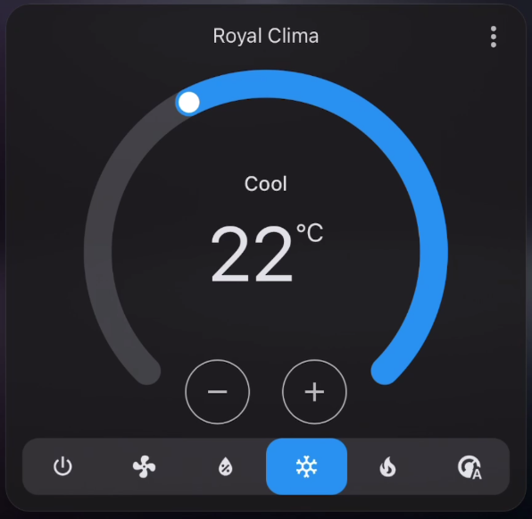

# TCL112AC IR Climate

Home Assistant climate integration and command-line tools for controlling a
TCL112AC-compatible air conditioner through a Moes UFO-R11 Zigbee IR
transmitter.

The captured remote uses the 112-bit TCL air-conditioner protocol
(`TCL112AC`). The project generates complete IR state frames, calculates their
checksums, converts them to Tuya/Zosung timings, and publishes the resulting
Base64 code through Zigbee2MQTT.



## Features

- Home Assistant `climate` entity
- Power control
- Auto, Cool, Heat, Dry, and Fan modes
- Integer target temperatures from 16 to 31 degrees Celsius
- Auto, minimum, low, medium, and high fan speeds
- Vertical swing control
- State restoration after a Home Assistant restart
- Standalone IR code generator and decoder

## Requirements

- Home Assistant with the MQTT integration configured
- Zigbee2MQTT
- Moes UFO-R11 (`TS1201`) IR transmitter
- A compatible air conditioner using the `TCL112AC` protocol
- Python 3.9 or newer for the standalone tools

The default Zigbee2MQTT device topic is:

```text
zigbee2mqtt/UFO-R11/set
```

## Home Assistant Installation

Copy the integration directory into the Home Assistant configuration folder:

```text
/config/custom_components/tcl112ac_ir/
```

The resulting layout must be:

```text
/config/custom_components/tcl112ac_ir/__init__.py
/config/custom_components/tcl112ac_ir/climate.py
/config/custom_components/tcl112ac_ir/ir.py
/config/custom_components/tcl112ac_ir/manifest.json
```

Add the platform to `/config/configuration.yaml`:

```yaml
climate:
  - platform: tcl112ac_ir
    name: Living Room Air Conditioner
    mqtt_topic: zigbee2mqtt/UFO-R11/set
```

Check the Home Assistant configuration and restart Home Assistant. Add the new
climate entity to a Thermostat or Tile card on a dashboard.

The integration is optimistic because an IR-controlled air conditioner does
not report its actual state back to Home Assistant. Changes made with the
physical remote are therefore not reflected automatically.

## Generate an IR Code

Generate a Base64 code for Cool mode at 23 degrees Celsius:

```bash
python3 ir_generate.py \
  --power on \
  --mode cool \
  --temperature 23 \
  --fan auto \
  --swing off
```

Generate a complete Zigbee2MQTT JSON payload:

```bash
python3 ir_generate.py \
  --power on \
  --mode cool \
  --temperature 23 \
  --fan auto \
  --swing off \
  --json
```

Publish it directly with an MQTT client:

```bash
mosquitto_pub \
  -h MQTT_HOST \
  -t 'zigbee2mqtt/UFO-R11/set' \
  -m "$(python3 ir_generate.py \
    --power on \
    --mode cool \
    --temperature 23 \
    --fan auto \
    --swing off \
    --json)"
```

Run `python3 ir_generate.py --help` to see all available options.

## Decode Captured Codes

Place one Zigbee2MQTT `learned_ir_code` Base64 value on each line of
`captures.txt`,
then run:

```bash
python3 ir_decode.py captures.txt
```

Optional labels are supported:

```text
cool_23: BASE64_CODE
heat_24: BASE64_CODE
power_off: BASE64_CODE
```

The decoder expands the Tuya/Zosung timing compression, detects TCL112AC
frames, prints their bytes, and validates the checksum.

## Protocol Notes

Each captured command contains two 112-bit frames separated by a long gap. The
normal frame stores the complete operating state rather than an individual
button press. Its last byte is an additive checksum of the preceding bytes.

The current special prefix and normal baseline were derived from three
matching captures of a Royal Clima remote in Cool mode at 24 degrees Celsius.
Compatibility is determined by the IR protocol, not the brand: units from
other manufacturers that use the same TCL112AC frame layout may work as well.
Air conditioners using another OEM protocol require a different encoder.

## Project Layout

```text
custom_components/tcl112ac_ir/     Home Assistant integration
ir_generate.py                     Standalone code generator
ir_decode.py                       Capture decoder and analyzer
```
